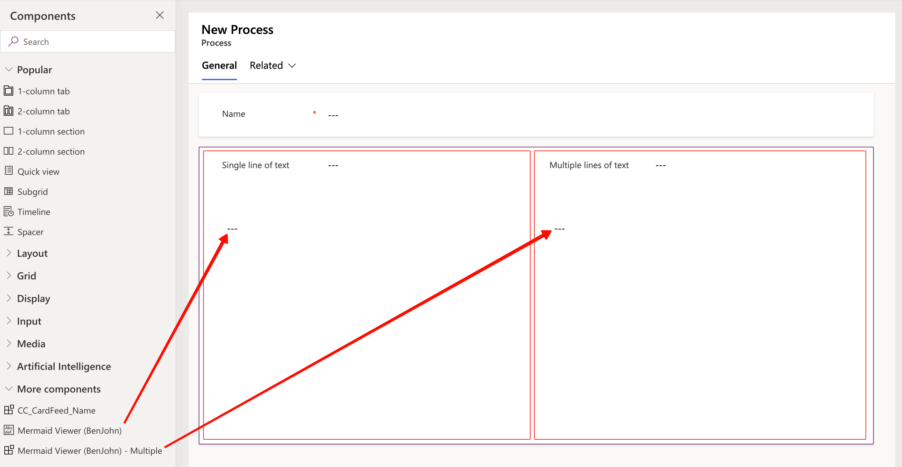
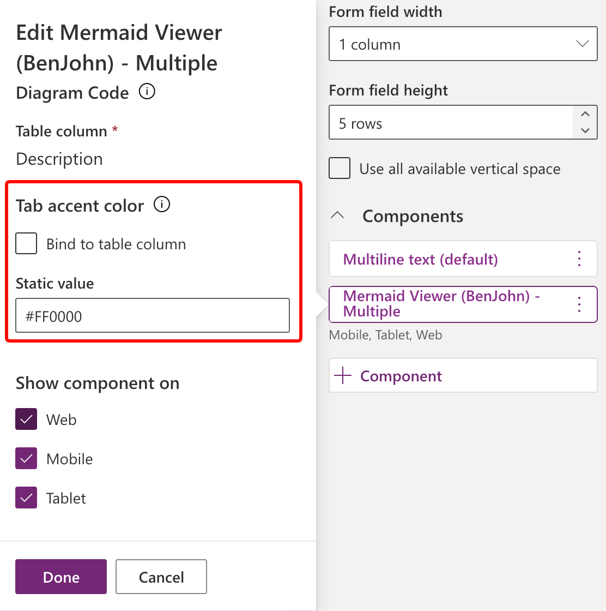
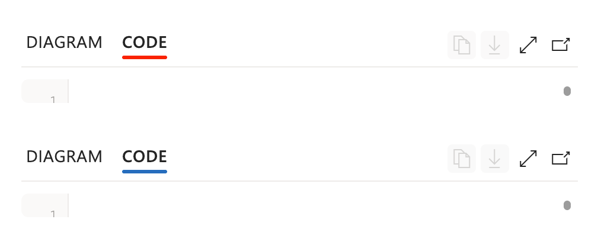
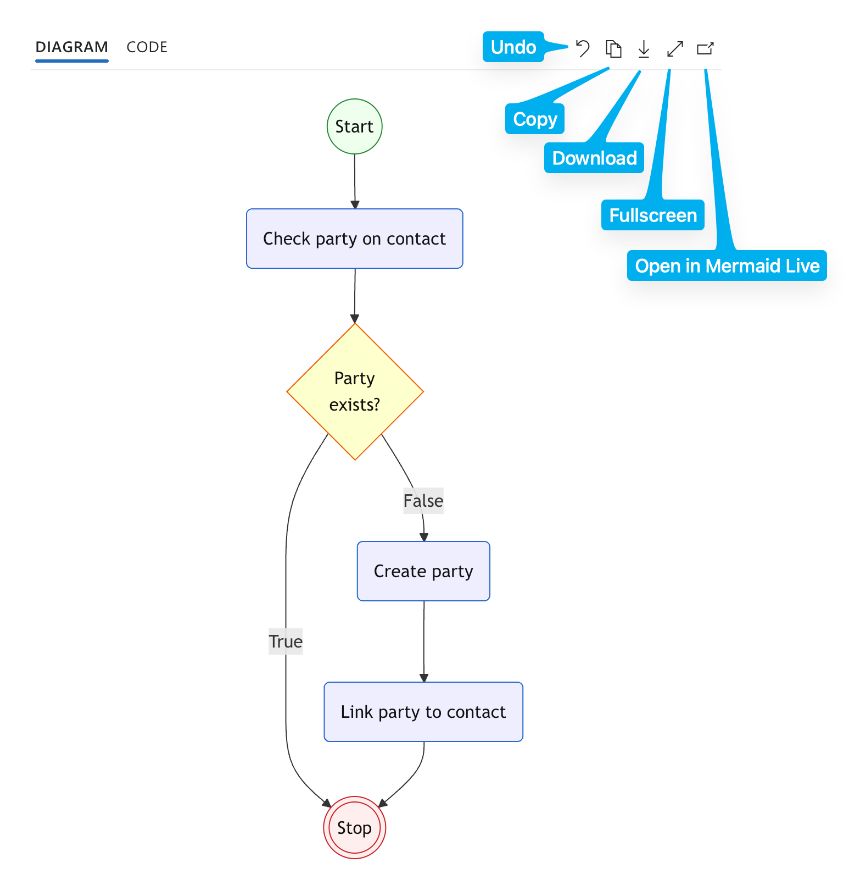

# Mermaid Viewer (BenJohn)

PCF controls to render Mermaid diagrams from Dataverse text fields.

## Controls

- MermaidViewer — **Single line of text (Text Area)**
- MermaidViewerMultiple — **Multiple lines of text**
  
  

## Local vs. Dataverse Testing

Local testing uses the PCF harness (``npm start watch``).  
Solution ZIP files are for import into Dataverse (Power Platform).

## Build and Run (Harness)

Run in repository root for MermaidViewer or in subfolder for MermaidViewerMultiple:
```powershell
npm run clean
npm start watch
```

## Build Solution Packages
From the Solutions folder:
```powershell
dotnet msbuild Solutions.cdsproj /t:build /p:Configuration=Release /p:SolutionPackageType=Managed
dotnet msbuild Solutions.cdsproj /t:build /p:Configuration=Release /p:SolutionPackageType=Unmanaged
```

## Version + Build (All-in-One)
From repository root:
```powershell
pwsh ./scripts/version-and-build.ps1
```
Optional for new Version:
```powershell
pwsh ./scripts/version-and-build.ps1 -Major 1 -Minor 0
pwsh ./scripts/version-and-build.ps1 -Version 1.0.20260104.1800
```

## Import into Dataverse
  1. Build managed/unmanaged ZIP packages or use the ones from the 'Solutions/bin/release/ Folder from this Repo.
  2. Open Power Apps Maker Portal.
  3. Go to Solutions → Import solution.
  4. Select the ZIP and complete import.
  5. Add the control to a supported text column on a model-driven form.
   

## Customizing
To match the color theme of the model-driven app, you can define a highlight color for the active tab.
 

## Demo


## Languages
The language to use gets detected over user settings. English is the default language if there is no matching translation.

Existing translations are:
- 1033 = English (US)
- 1031 = German
- 1034 = Spanish
- 1036 = French
- 1040 = Italian

## Licensing / Third-Party Notices
Third-party license texts are in ThirdPartyLicenses/ and must be included in distributions.
Dependency versions and notices are documented in THIRD-PARTY-NOTICES.txt.