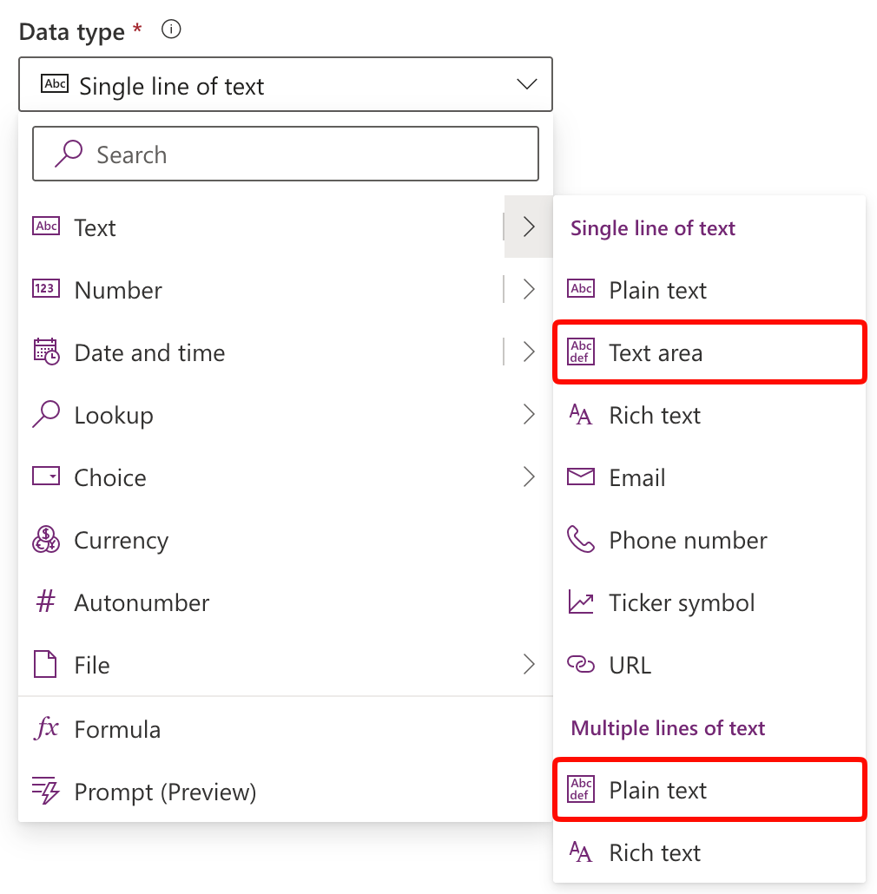
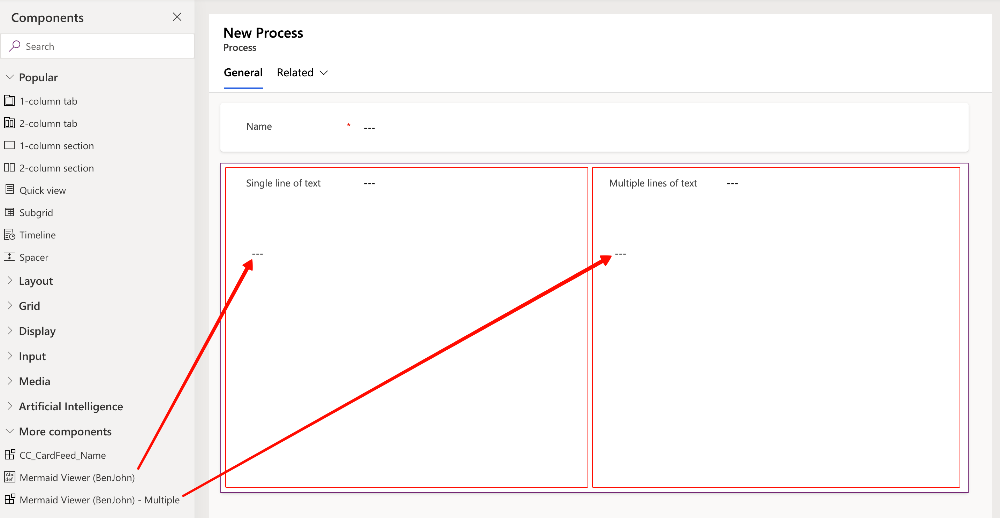
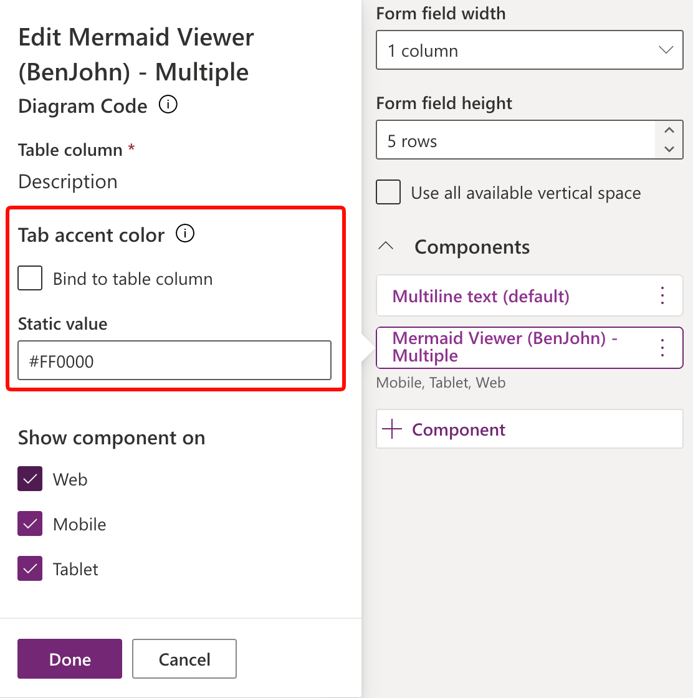
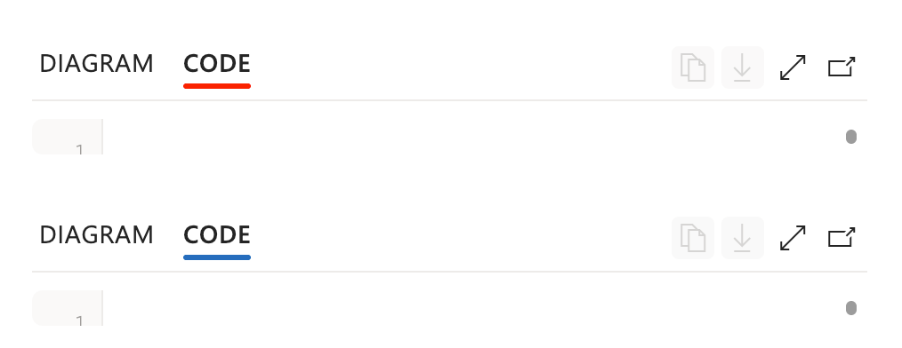
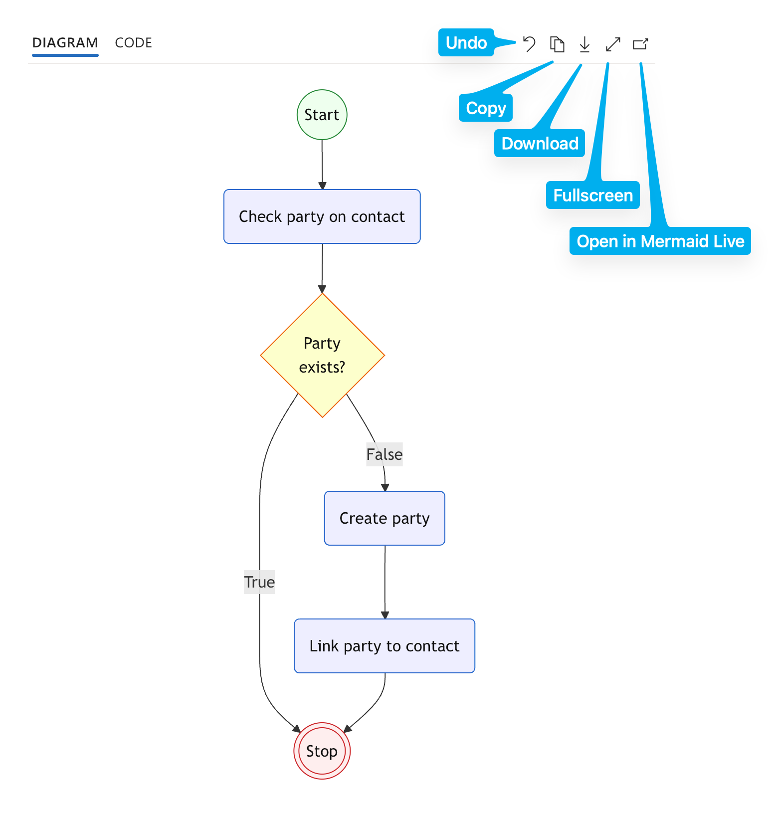

# Mermaid Viewer (BenJohn)

PCF controls to render Mermaid diagrams from Dataverse text fields.

## Controls

- MermaidViewer — **Single line of text (Text Area)**
- MermaidViewerMultiple — **Multiple lines of text**
  
  

## Features

- **Diagram tab** — live rendering of the Mermaid diagram
- **Code tab** — editor with syntax highlighting and line numbers (hidden in read-only mode)
- **Zoom & Pan** — mouse wheel to zoom, drag to pan the diagram
- **Double-click** — resets diagram to fit the container
- **Fullscreen** — available for both the diagram and code tab
- **Undo / Redo** — up to 50 steps
- **Copy** — copies SVG markup or Mermaid code depending on the active tab
- **Download** — saves the diagram as `.svg` or the code as `.mermaid`, filename includes timestamp and record name
- **Open in mermaid.live** — opens the current diagram in the Mermaid Live Editor in a new tab
- **Read-only mode** — set via the `readOnly` property or the form's disabled state; hides the code tab
- **Error display** — shows a message when the Mermaid code cannot be parsed

## Import into Dataverse
  1. Build managed/unmanaged ZIP packages or use the ones from the 'Solutions/bin/release/ Folder from this Repo.
  2. Open Power Apps Maker Portal.
  3. Go to Solutions → Import solution.
  4. Select the ZIP and complete import.
  5. Add the control to a supported text column on a model-driven form.
   

## Customizing
To match the color theme of the model-driven app, you can define a highlight color for the active tab.
 

## Demo

## Languages
The language to use gets detected over user settings. English is the default language if there is no matching translation.

Existing translations are:
- 1033 = English (US)
- 1031 = German
- 1034 = Spanish
- 1036 = French
- 1040 = Italian

## Licensing / Third-Party Notices
Third-party license texts are in ThirdPartyLicenses/ and must be included in distributions.
Dependency versions and notices are documented in THIRD-PARTY-NOTICES.txt.